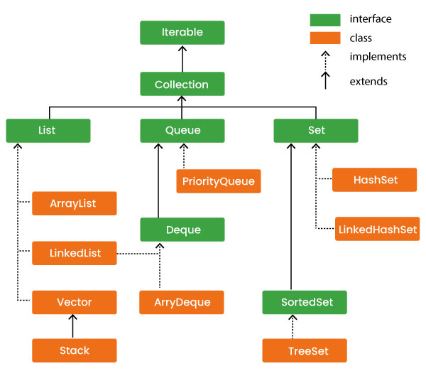

# Java Core concepts

## Abstract class
- An abstract class is a restricted base class in object-oriented programming that cannot be instantiated (used to create objects) and is designed to be inherited by subclasses. 
- It acts as a blueprint, allowing for a mix of abstract methods (without bodies) and concrete methods (with implementations) to enforce a common, mandatory structure for child classes.
- They can contain abstract methods (must be implemented by subclasses) and concrete methods (regular methods with code).
- Subclasses must implement all abstract methods, or they must also be declared abstract.
- Note: Non-abstract methods can be left (not defined) in subclasses. This is where the difference comes from an interface as we can have non-abstract methods also in an abstract class.

## Interface
- An Interface in Java is an abstract type that defines a set of methods a class must implement.
- By default, all variables in an interface are final and static. This is because we don't instantiate an interface, we implement it, also it doesn't have memory allocated to it.
- By default, all declared methods in an interface are public and abstract.

## Multithreading, concurrency
-  Java provides different mechanisms, such as synchronized, volatile, and atomic variables, to handle shared data across threads.
- 

### Synchronized, Volatile, Atomic

#### Synchronized
  - Synchronized keyword ensures that only one thread at a time can execute a particular method or block of code on a given object.
  - It prevents concurrent threads from interfering with each other while modifying shared data.
  - It provides:
    - Mutual exclusion: one thread at a time executes the synchronized code.
    - Visibility: changes made by one thread become visible to others after the lock is released.

#### Volatile
  - The volatile keyword in Java ensures that all threads have a consistent view of a variable's value. 
  - It prevents caching of the variable's value by threads, ensuring that updates to the variable are immediately visible to other threads.

#### Atomic
  - Atomic Variables provide lock-free, thread-safe operations on single variables. 
  - They ensure atomicity and visibility using low-level Compare-And-Swap (CAS) operations without using synchronization.

| Feature | Synchronized | Volatile | Atomic |
| :--- | :--- | :--- | :--- |
| **Applies to** | Methods/blocks | Variables | Variables |
| **Purpose** | Ensures mutual exclusion and consistency (via locks) | Ensures visibility (no atomicity) | Provides atomic operations (no locks) |
| **Performance** | Lower (due to locking) | Higher than synchronized | Higher than both synchronized and volatile |
| **Concurrency** | Prone to deadlocks/livelocks | Immune (no locks) | Immune (no locks) |

### Race condition
#### 🔗 Reference: Race Condition Vulnerability

> **Note:** For a deep dive into how race conditions affect operating systems and security, check out the full guide on GeeksforGeeks.