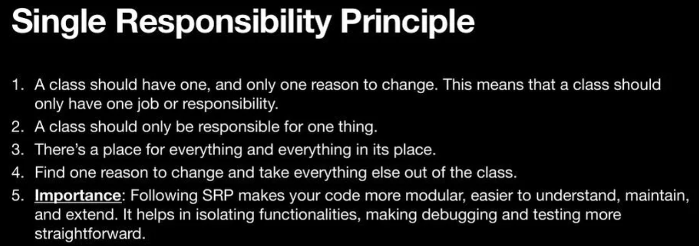
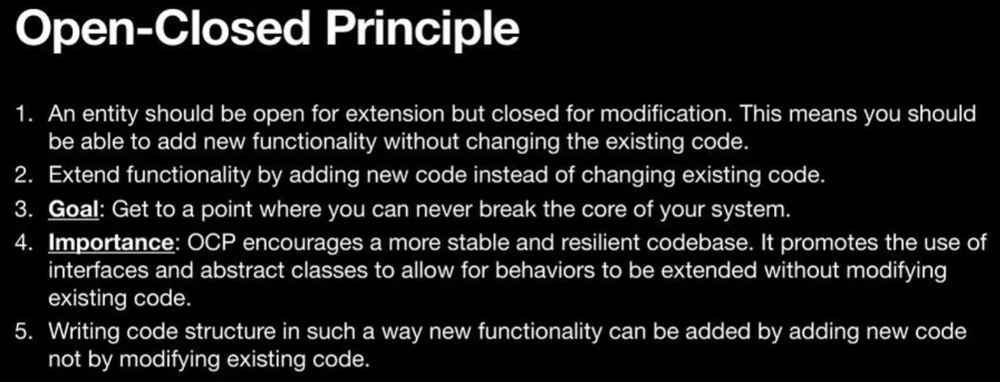
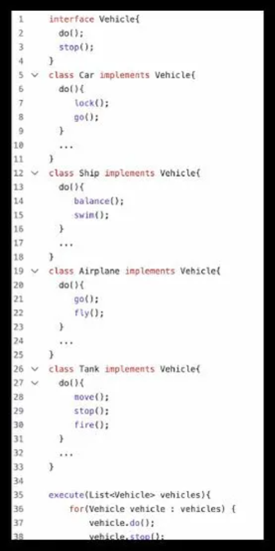

# Intro to SOLID principles

## SR principle

- One class should have only one responsibility.
- E.g. 'Order' should have different class, 'Payment' should have different class.
## OP principle

- Cyclomatic complexity: The no. of branches in your code due to if/else or Switch statements. The lesser the cyclomatic complexity, the better your code.
- Down-casting is a bad thing.
- Type checking is anti abstraction.
