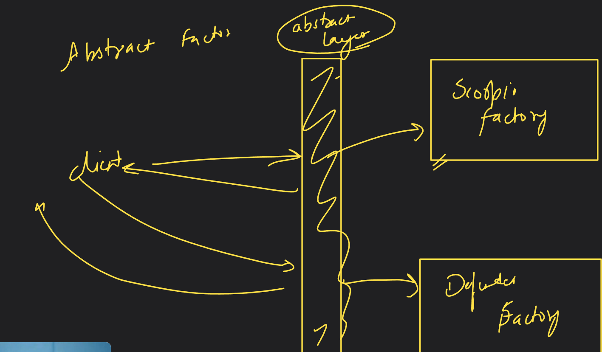

# Introduction to Design Patterns

## Design pattern
- It is a standardized template to write clean code that is easily understandable.
- These are invented to solve frequently occurring design problems with code.

### Categorisation
1. Creational
2. Structural
3. Behavioural

## Creational Design patterns
- Focus is on encapsulation of object creation process i.e. how we are preparing our object to be served to the client.

## Factory Pattern
- There are 3 types of Factory Method patterns:
  - Simple factory
  - Factory method
  - Abstract factory
- It provides an interface/utility/method for object creation in which we are delegating the actual instantiation of objects to subclasses.
- E.g. 1) A obj = new B(); Here A, B are loosely coupled. 2) A obj = new A(); Here A,B are tightly coupled.
- Always code to an interface, not an implementation.
- Some people prefer simple factory instead of the complex factory method as it creates confusion.
- It is advisable to use complex or abstract factory pattern.

### Abstract Factory Pattern
- It is a pattern where we apply a factory over another factory, i.e.(Factory of factories).
- It solves the issue of problem of creating families of related products.
- It is defining of interface to create families of dependent objects without creating classes.

* Note: Concrete classes are classes in which provide all implementation logic and don't hide anything while in abstract we hide certain implementations. Basically just the opposite of abstract class.