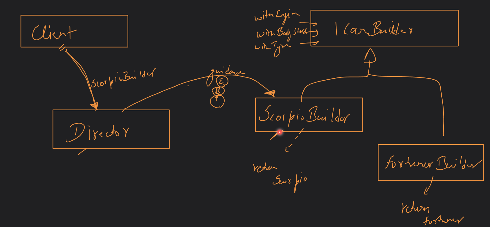
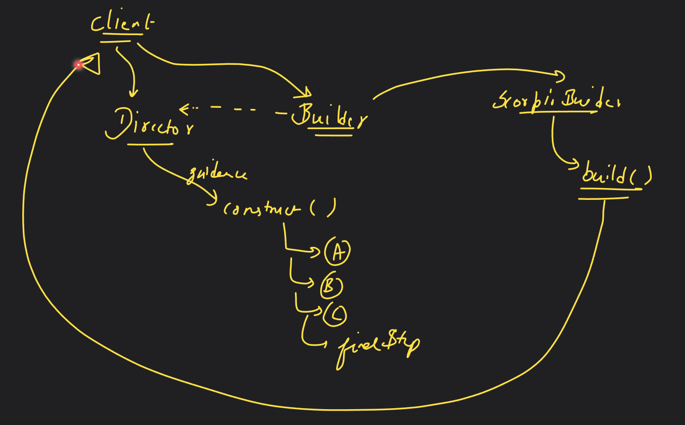

# Introduction to Singleton and Builder pattern

## Builder pattern
- It is used when we need to build aggregate object / composite object.
- When we need to hide process of step by step creation of object.
- Telescoping pattern: When we keep adding multiple parameterized constructors as the use-case increases, we indirectly abuse polymorphism, and this process is called telescoping pattern. We should avoid this!
- Hence, in a case where we need to create different types of objects without modifying the constructor, we use builder pattern.
- This is over-utilized pattern i.e. being used very much in daily life.
- There are two main players in this pattern:
  - Director: Directs/guides the construction of the object.
  - Builder: Implements the guidance.
- Principle: Client provides the director with builder, director provides guidance to the builder, builder creates final object and returns it to the client.
- Principle: Client calls builder, builder performs steps and returns the final object to client.

- * Note: Builder makes step by step object while abstract makes concrete object.

## Singleton pattern
- This pattern enforces creation of a single object of a class.
- In the whole application lifecycle, to interact with that class we can only use that one single object.
- This can be used in thread pool, cache, etc.
- To use this pattern, mark the construction of the class as private and provide a point where we can return an instance of the class if not already created.
- Principle: If the object is not created, create it. Return the object.
- * Note: This pattern could break in Multithreaded environment/process. It breaks on context-switching just before creation of the object leading to creation of two objects, i.e. race condition occurs.
- How to solve this issue? Below are a few methods we can use:
  1) Use 'synchronized' keyword (Java) before the class so that process is locked for one process/thread. This is very expensive though, system calls, kernel instructions.
  2) 'static' initialization. This leads to creation of only one object. Although this leads to wastage of resources, the object is created before it is needed leading to performance issues. There could be one more issue where this object depends on other objects that are not yet created (early initialization). Solution to early initialization is lazy initialization i.e. initialization on demand.

- * Double - checked locking: If object is not created, then keep lock (synchronized) else not needed.
- * Explore volatile keyword in java.

