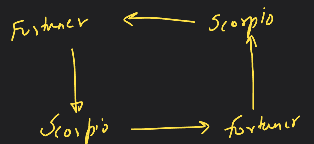

# Introduction to Prototype pattern
- This is the last pattern in creational design pattern type.
- Focus is on how to create a new object by copying an existing object.
- * This is usually used at places where creating a copy of the object is less resource intensive than to create a new one. E.g. An object that uses DB query, read/write a file to create an object is resource intensive, it is better to create a copy of that object.

- Shallow vs deep copy.
- 'Cloneable' is an interface in Java that provides info to the compiler that we are going to use cloning in the class. <not much needed>
- Circular reference: 
- It is tricky to have cloning in this. But we can do it. You need to have graph/backtracking knowledge in this. Ref ques. Rat in a maze. We track visited nodes in that question.

- * Note: This pattern in only used when copying is less resource intensive than creating a new one.
  ❗ This is not used to reduce number of classes.