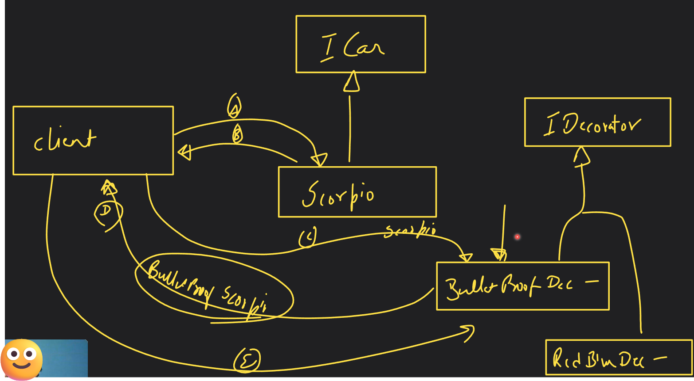
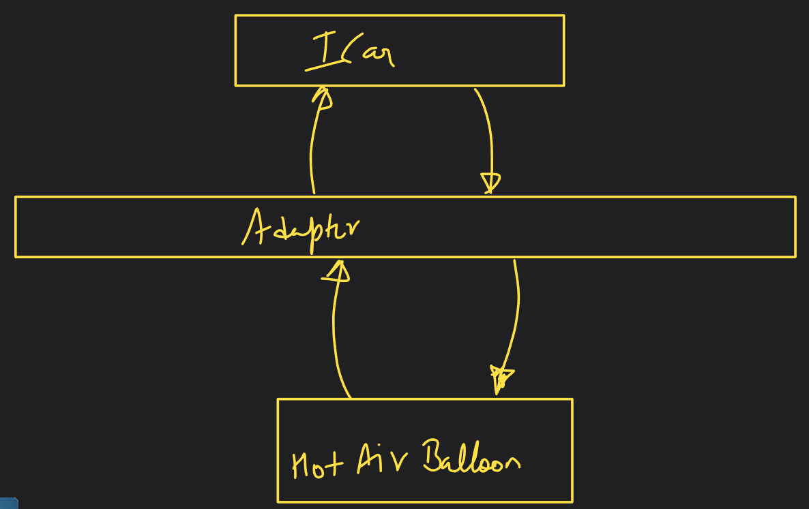
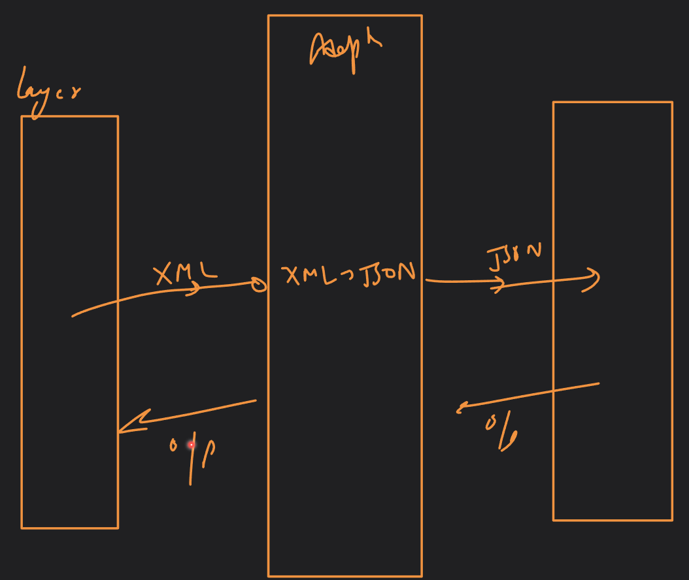
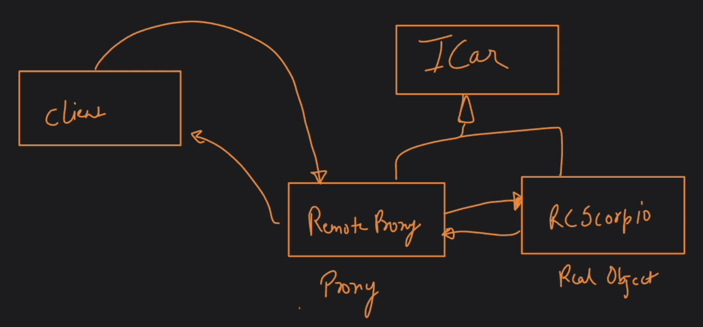
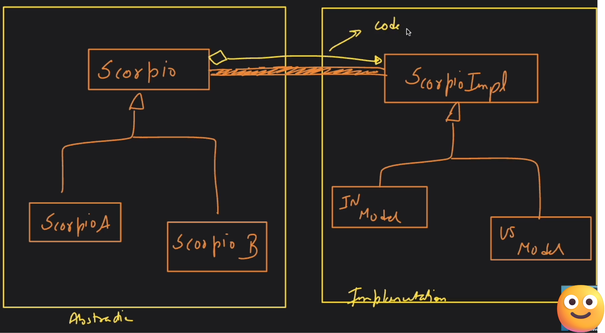
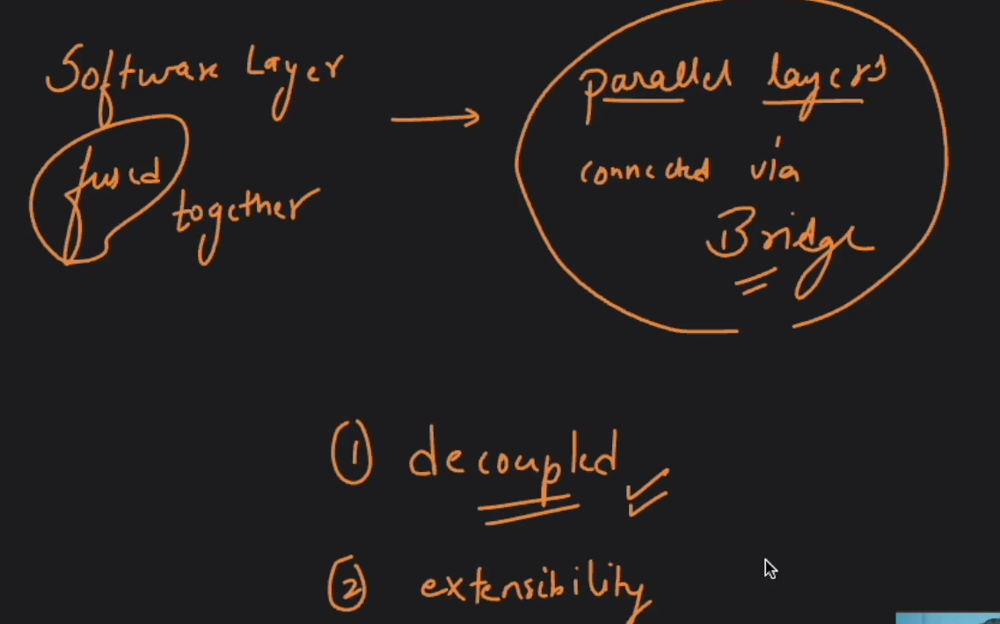
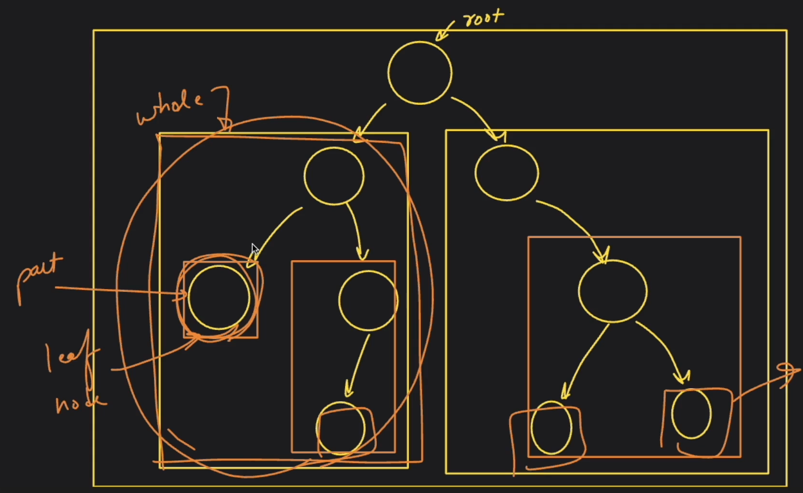
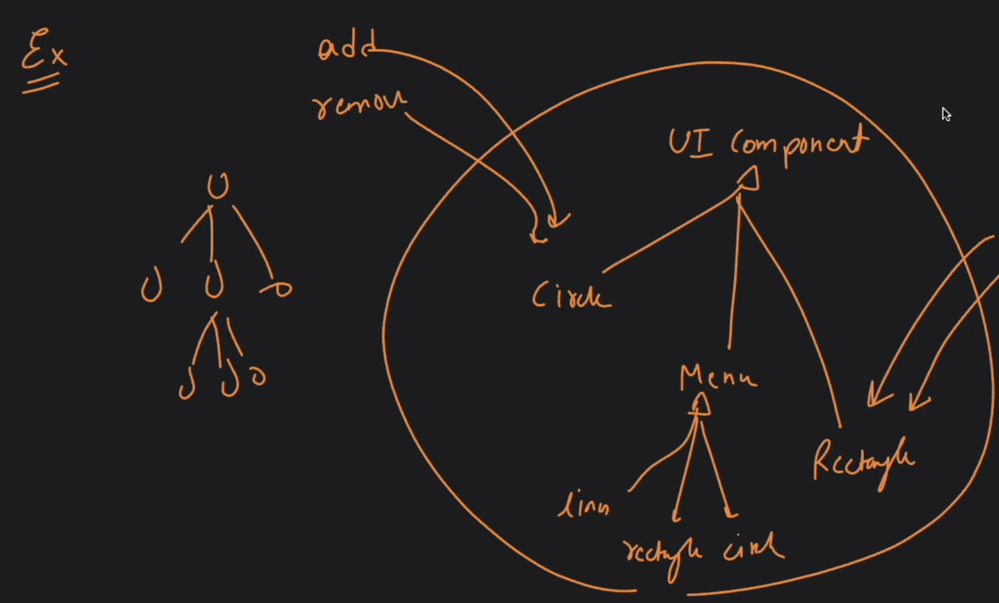

## Structural Design patterns
- Focus is on designing systems in a way that new changes do not affect existing system.
- Basic focus is on structuring of a class.

## Types
1. Decorator pattern
2. Adapter pattern
3. Proxy pattern
4. Facade pattern 
5. Bridge pattern 
6. Composite pattern 
7. Flyweight pattern

### Decorator pattern
- Focus is on non-essential things.
- If we want to add non-essential features, we can simply create decorators.

### Adapter pattern
- A pattern that enables 2 non-compatible entities to communicate with each other.
- This is achieved by converting the interface of one class into another expected by client.

### Proxy pattern
- Proxy means authority to represent someone else.
- This pattern enables **access control**.
- The primary purpose is to provide a placeholder in place of the real object to enable access control.
- Nobody else except the proxy is allowed to communicate with the real object.
- Remote proxy: In this case,source/real object is present at a different location.
- Virtual proxy: In this case, a request can be full-filled in the proxy layer itself (caching) without calling the real object.
- Security/Authentication/Authorization proxy: In this case, proxy validates a request before forwarding it to the real object.

### Facade pattern
- Facade means mask / front view.
- In this pattern, we create an interface to interact with a complex/complicated system.
- The goal is to provide a simple interface for a complex system having multiple system.
- To **hide the underlying complexity**.

### Bridge pattern
- We use this to decouple abstraction from implementation.
- Bridge pattern lets you vary the abstraction (abstract/interface) from implementation (concrete class).
- This pattern is applied while implementation and adapter pattern is applied after the system has been deployed.
- This pattern promotes decoupling in system. More the coupling more the cohesion.

### Composite pattern
- Composite means made up of various elements.
- Whenever we face a situation where the structure resembles a tree like structure, and we want to treat 'whole' and 'parts' similar in it, then we use this pattern.

### Flyweight pattern
- Flyweight means light-weight category in boxing.
- The intention is to save memory.
- Intrinsic property: Properties that do not change with the change in context.
- Extrinsic property: Properties that change with the change in context.
- **Intrinsic property should have shared memory for all objects.**
- We can achieve this by using function calls.