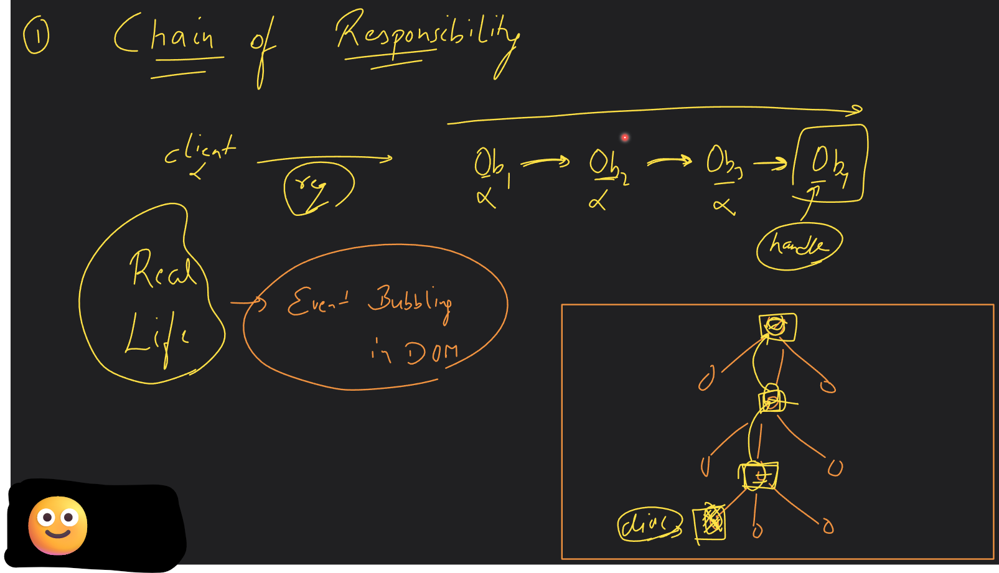
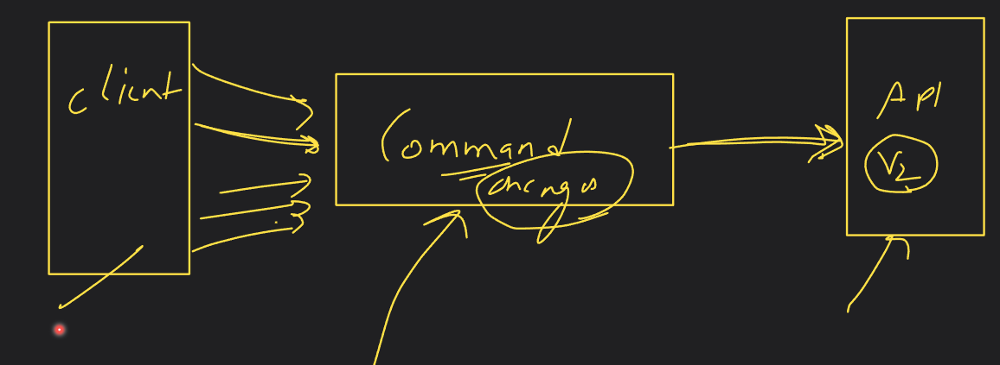
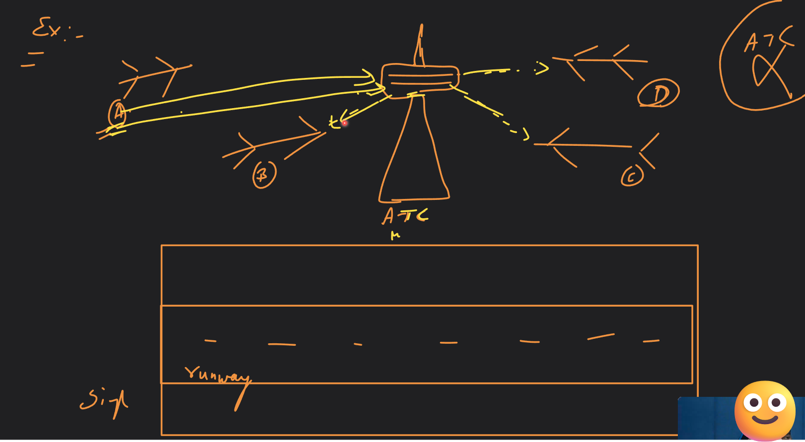
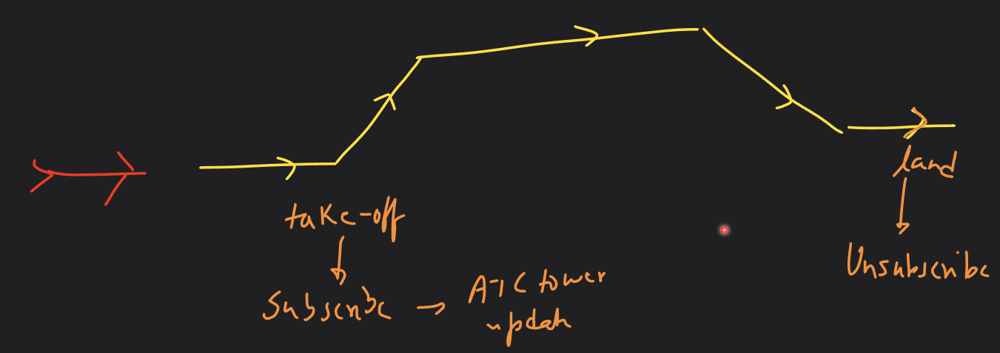
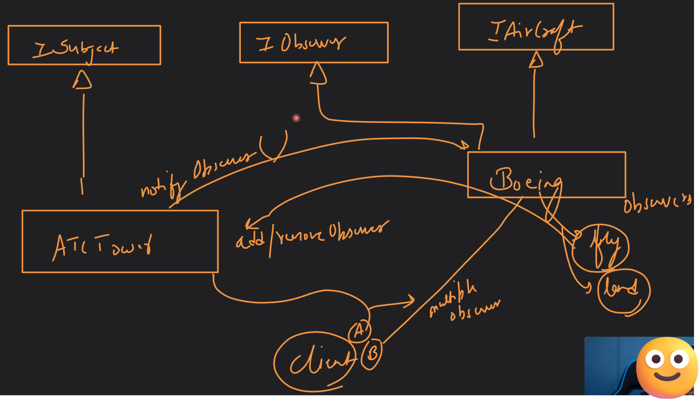

## Introduction to Behavioral pattern
- Focus is on object interaction and responsibility delegation.

### Types
1. **Chain of responsibility (COR)**
2. **Command**
3. **Observer**
4. Mediator
5. Iterator
6. Visitor
7. **Strategy** ⭐
8. State - Different from Strategy
9. Template

### 1. Chain of responsibility
- Focus is on propagation of requests to different objects within the system.
- All objects in chain must have a common interface to execute this pattern.
- Every object has a reference of the next object in line.

### 2. Command pattern
- Focus is on decoupling two objects - 1. object that requests (invoker), 2. object that fulfills (receiver).
- We can perform Undo, logging, queueing, callbacks, timeout commands using this pattern.

### 3. Mediator pattern
- This pattern encourages loose coupling b/w interacting objects by encapsulating their interaction in a mediator object reducing many to many interaction b/w them.
- Central Authority is given to a single entity to establish communication b/w objects/systems/entities.
- The interaction is many to many without a central authority, hence we establish this.
- There is one to many communication b/w mediator and objects.
- We can apply locks, synchronized in case of multithreaded environment to avoid race condition.
- E.g.: If there is no ATC, multiple airlines will communicate b/w each other to land on the air-strip causing delay in response sometimes.

### 4. Observer pattern
- It focuses on how updates can be communicated efficiently to interested parties.
- This is what we call Publisher-subscriber (Pub-sub) model.
- Subject (publisher) posts the information and observers (subscriber) consume that information.
- It is defined as one to many dependency b/w objects so that when one object changes state, all others are notified.
- There are two models in to do this - push (no getter/setter) and pull model (with getter/setter).
- This pattern focuses only on interested entities, while COR pattern send info to all entities.

