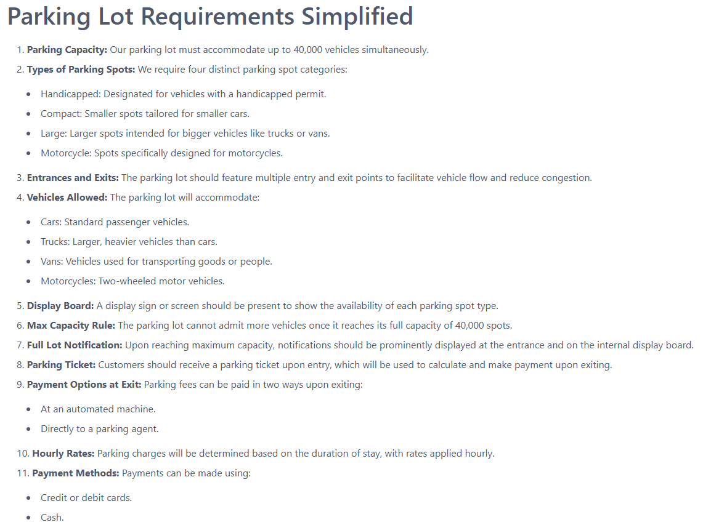
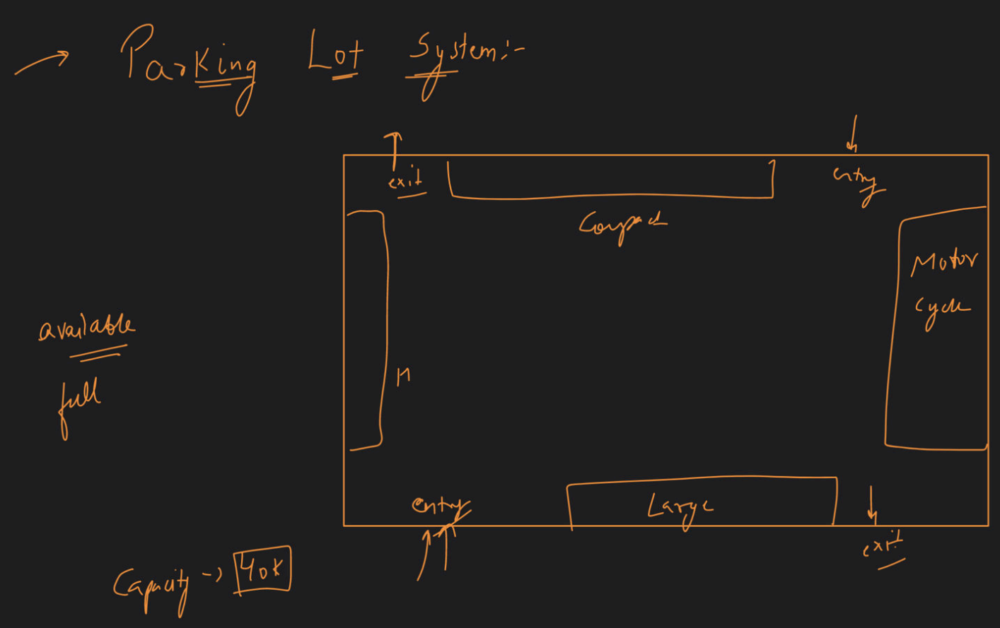
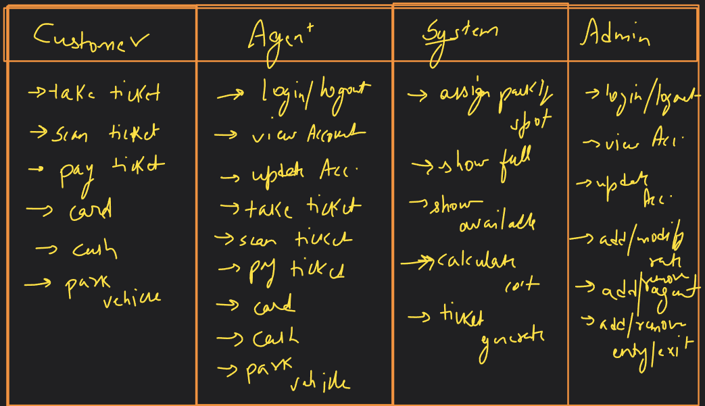
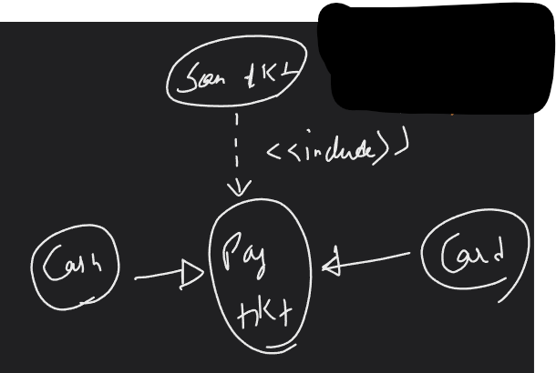
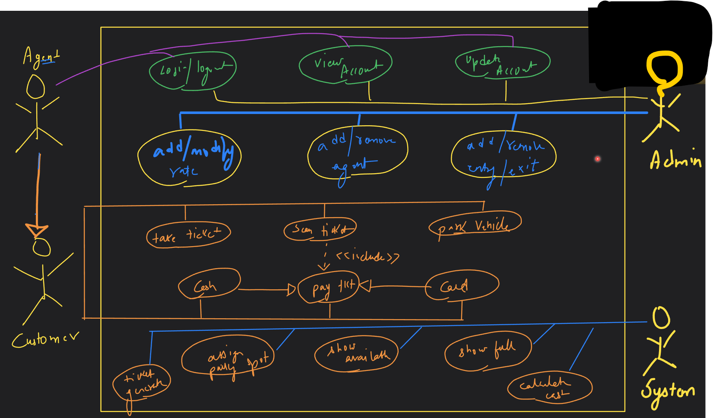
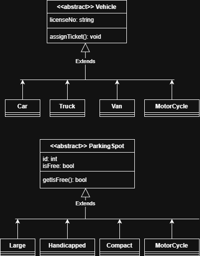
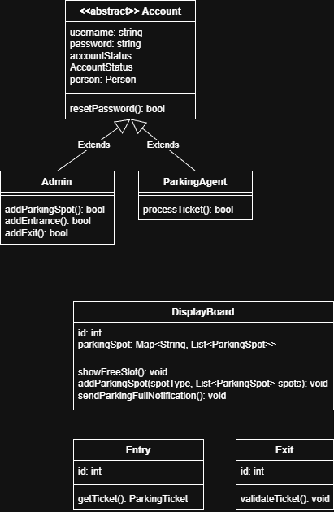
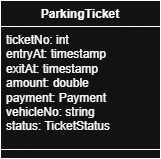
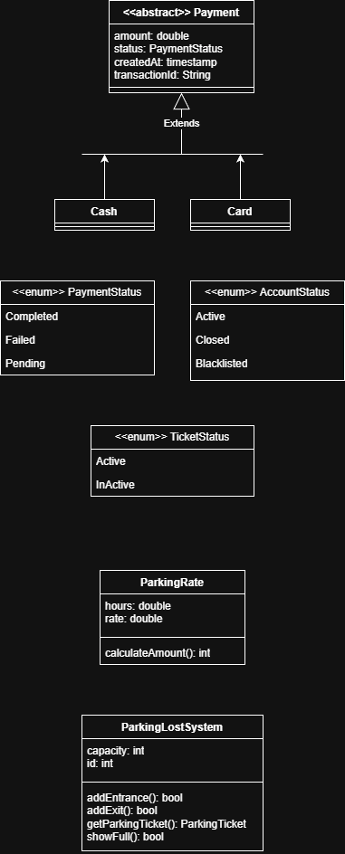
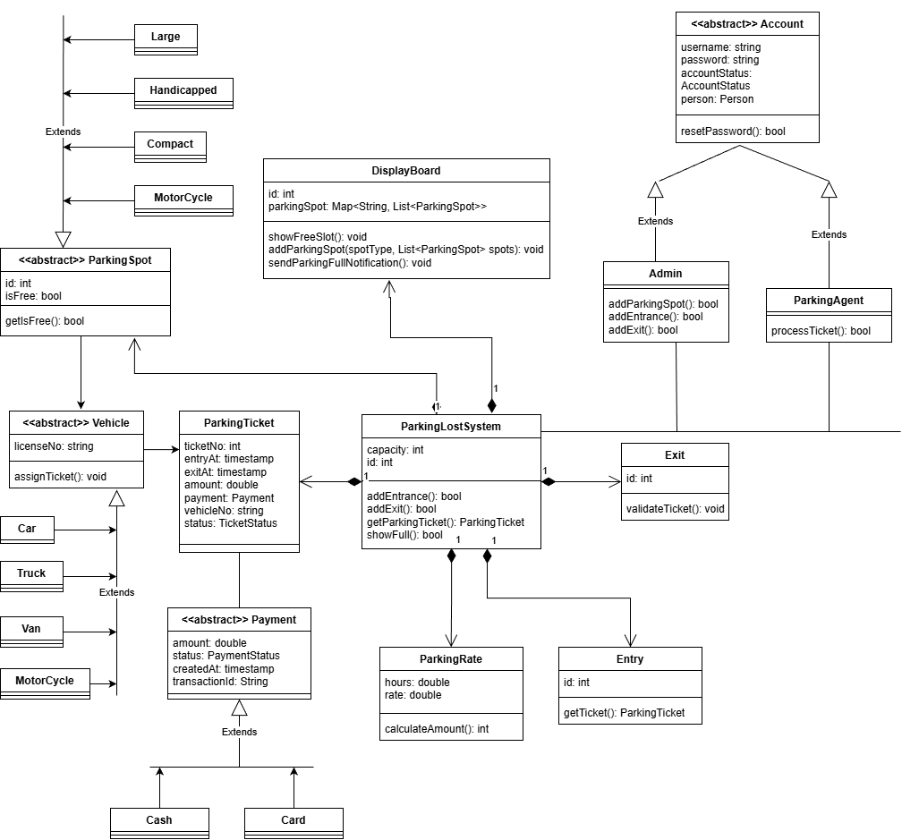

# Design problem 1

## Steps to solve (approach):
1. Identify requirements. (It is already provided here, in the interview ask questions).
2. List down all the **use cases** (payment, parking lot full, etc.). Think this all out loud.
3. **Class diagram** creation.
4. Sequence diagram (optional, create only when you need to clarify a particular feature to the interviewer).
5. Activity diagram (optional, create only when you need to clarify a particular feature to the interviewer).
6. Code it! First only focus on mandatory features.

## Parking Lot System

- Use-case diagram
  - Actors:]
      
  - Use-cases
    
  - Relationship (Association, Generalisation, etc.)
    
- Class diagram
  - First create all small classes.
    
    
    
    
  - Then combine all of them.
    
- Using singleton pattern for this.

**Note**: The more you spend time on creating the class diagram, the less time you will spend on coding.